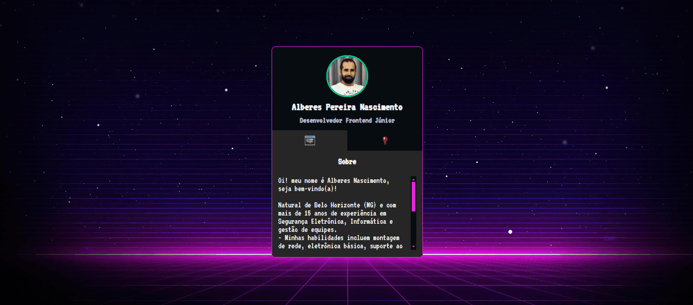

# Mini Portfólio

Este é o repositório oficial do mini portfólio desenvolvido para apresentar meus contatos e meus trabalhos e projetos.

## Descrição

Este mini portfólio foi desenvolvido como parte de um projeto para apresentar meus contatos e meus trabalhos e projetos. O objetivo é fornecer uma visão geral das habilidades, experiências e projetos realizados por mim.

## Recursos

- Apresentação pessoal.
- Informações de contato.
- Acesso aos meus projetos
- Design responsivo para garantir uma boa experiência de usuário em dispositivos móveis.

## Tecnologias Utilizadas

- HTML5
- CSS3
- JavaScript

## Como Contribuir

Se você deseja contribuir com o desenvolvimento deste projeto, siga as etapas abaixo:

1. Faça um fork do repositório
2. Crie uma branch para sua nova funcionalidade (`git checkout -b feature/nova-funcionalidade`)
3. Faça commit das suas alterações (`git commit -am 'Adicionando nova funcionalidade'`)
4. Faça push para a branch (`git push origin feature/nova-funcionalidade`)
5. Crie um novo Pull Request

## Autor

- **Alberes** - *Desenvolvedor Web Freelance* - [Seu GitHub](https://github.com/Alberesbass)

## Licença

Este projeto está licenciado sob a Licença MIT - consulte o arquivo [LICENSE.md](LICENSE.md) para obter detalhes.
